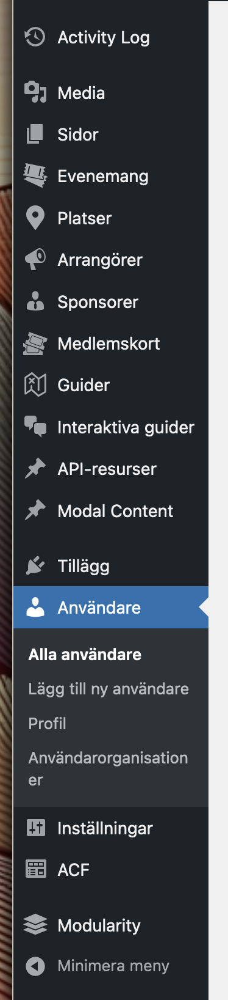
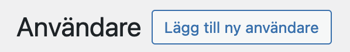
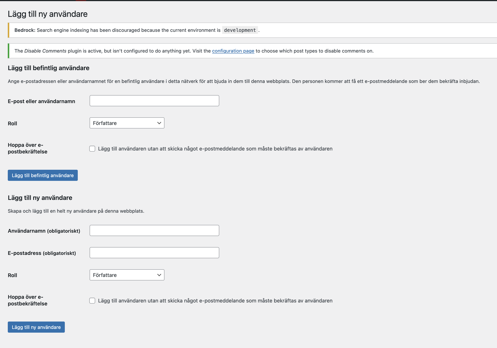
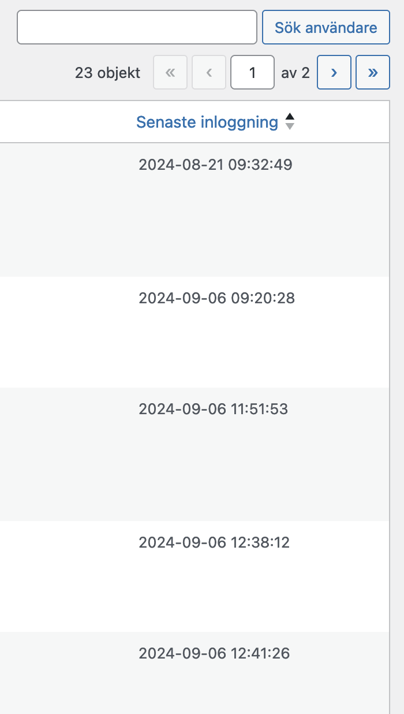

# Användarkonton 

## Lägga till en ny användare

För att lägga till en ny användare klickar du på _Användare_ i sidopanelen:

Klicka därefter på _Lägg till ny användare_ i överkanten av skärmen:

Du kommer nu till en panel med 2 sektioner: en för att lägga till en befintlig användare, samt en för att lägga till en ny användare. Tänk på att välja den nedre av de två:

Här fyller du först i användarnamn. Användarnamnet skapar du genom att ta allt till vänster om @ i epost-adressen och ta bort alla punkter. Lägg därefter på ett slumpmässigt 4-siffrigt nummer som kan genereras exempelvis här: https://numbergenerator.org/random-4-digit-number-generator

Om epost-adressen är sven.andersson@minmejl.se så blir alltså användarnamnet tex _svenandersson1070_.

Fyll därefter i epost-adress och välj _redaktör_ när det gäller _roll_.

Låt checkrutan vara tom då vi vill att ett epost-meddelande skickas ut till den nya användaren.

Den nya användaren kommer nu få ett epost med en länk för att aktivera sitt konto.

Avvakta nån dag och kolla så att den nya användaren har loggat in. Det gör du genom att gå till användar-panelen och titta på kolumnen längst till höger som heter _Senast inloggning_. När det dykt upp ett datum där vet du att registreringen fungerat.

Om sajten är en så kallad _multisajt_ behövs ytterligare ett steg. Du behöver då byta till en av undersajterna genom att klicka på _Mina nätverksplatser_ och välj sajten i fråga.

Därefter går du återigen till användar-panelen och klickar på _Lägg till ny användare_. Den här gången väljer du istället att fylla i fälten under _Lägg till befintlig användare_. Du kan även kryssa i checkrutan för _Hoppa över e-postbekräftelse_ i och med att användaren redan har loggat in på huvudsajten.

Gör om det dessa steg om det finns ytterligare undersajter.

Detta är nödvändigt för att användaren ska kunna komma åt alla undersajter och inte bara huvudsajten.

