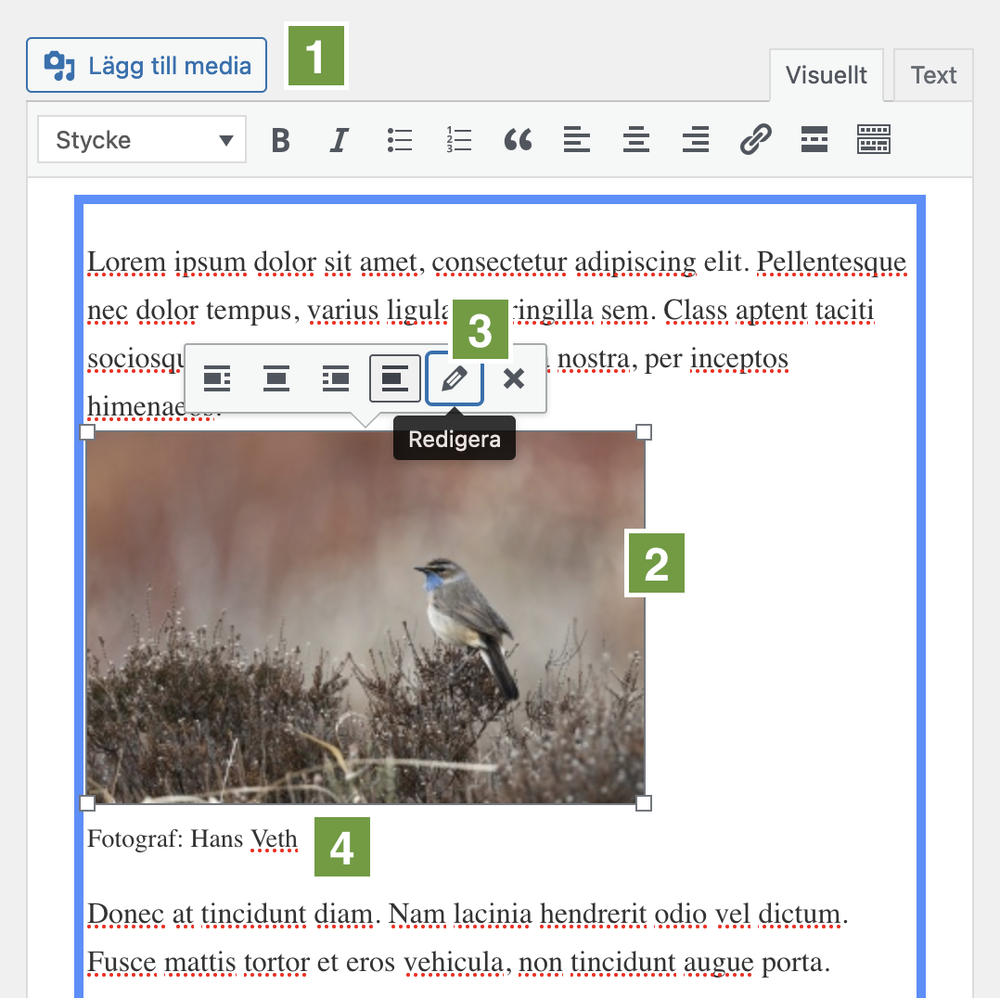
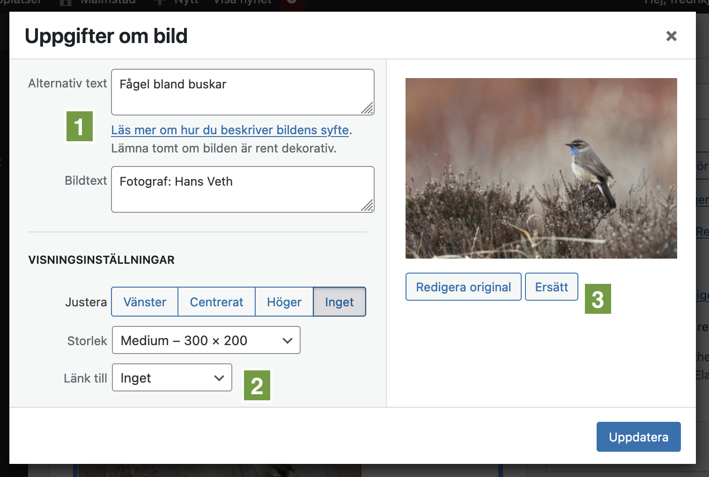
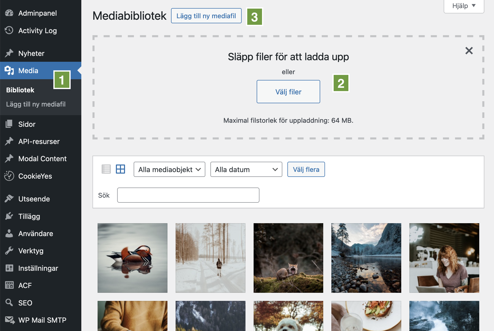
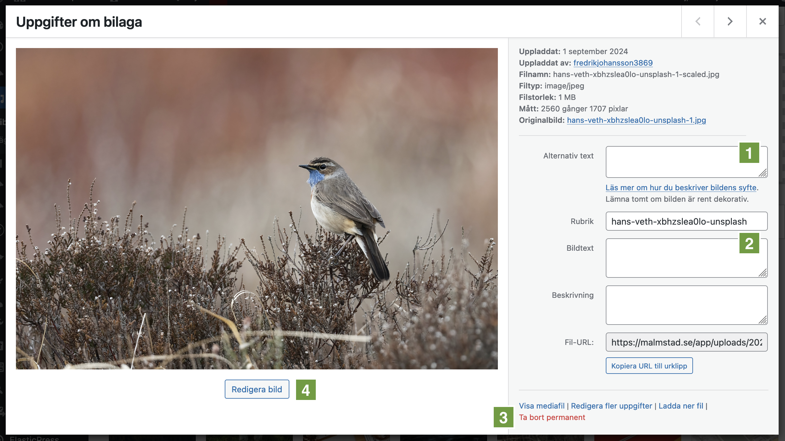

# Bilder och mediabiblioteket

## Lägga till bilder i texteditorn

För att lägga till en bild i nyhetstexten klickar du på _Lägg till media_
ovanför texteditorn **(1)**. Du kan då välja en bild från mediabiblioteket eller
ladda upp en ny bild. [Läs mer om mediabiblioteket nedan](#mediabiblioteket).

När du har lagt till en bild kan du klicka på bilden för att ändra storlek och
justering **(2)**. Dra i hörnen för att ändra storlek. Klicka på _Redigera_
(pennan) för att ändra inställningar som t.ex. bildtext och länk **(3)**.

### Redigera bildtext, länk, m.m.

Efter att du klickat på _Redigera_ (pennan) på en bild i texteditorn kommer en
ruta upp där du kan göra fler inställningar för bilden.

_Alternativ text_ är en beskrivande text som visas för skärmläsare och om bilden
inte kan laddas in. _Bildtext_ är den text som visas synligt under bilden. Här
kan du till exempel ange fotografens namn. Dessa fält fylls automatiskt i om du
väljer en bild från mediabilbioteket och den har dessa uppgifter ifyllda
**(1)**.

Under rubriken _Visningsinställningar_ kan du ändra storlek och justering men du
kan också välja att länka bilden till en annan sida **(2)**.

Du kan även byta ut bilden genom att klicka på _Ersätt_ **(3)**.

Klicka på _Uppdatera_ för att spara ändringarna eller krysset längst upp till
höger för att avbryta.

## Mediabiblioteket

Alla bilder som laddas upp webbplatsens redaktörer hamnar i mediabiblioteket. Du
kan också ladda upp bilder direkt till mediabiblioteket för senare användning.
Du hittar mediabiblioteket i adminpanelens vänstermeny under _Media_ **(1)**.

Längst upp på sidan finns en yta där du kan släppa filer för att ladda upp dem
**(2)**. Du kan också klicka på knappen _Välj filer_ för att öppna en dialogruta
där du kan välja filer från din dator. Om ytan inte syns klickar du på knappen
_Lägg till ny mediafil_ **(3)** så dyker den upp.

Klicka på en bild för att se mer information om den. I rutan som visas kan du
även ange alternativ text **(1)** och bildtext **(2)** samt redigera bilden.

:::info[Obs!]

Kom ihåg att alltid ge bilder en beskrivande alternativ text för att underlätta
för synskadade som använder skärmläsare. Det är också bra för
sökmotoroptimering.

:::

Du kan ta bort bilden permanent genom att klicka på _Ta bort permanent_ **(3)**
längst ner till höger.

Om du behöver beskära eller rotera bilden kan du göra det genom att klicka på
knappen _Redigera_ **(4)**.

:::info[Obs!]

Ändringar som görs i denna ruta sparas automatiskt.

:::
