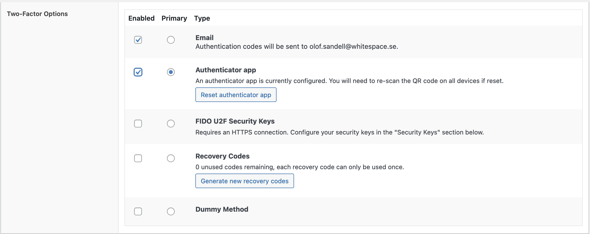
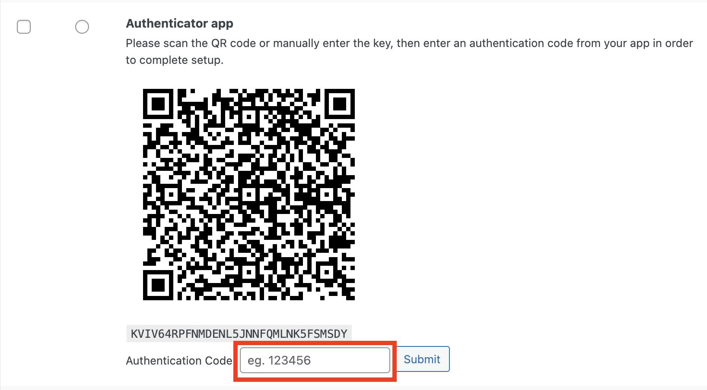

För att logga in i Wordpress adminpanel skriver du in adressen till din
webbplats i webbläsaren och lägg till `/wp-admin` i slutet av adressen. Exempel:
`https://www.minwebbplats.se/wp-admin`

Du kommer till en inloggningsruta. Här skriver du in ditt användarnamn och
lösenord.

När du loggat in kommer du till _adminpanelen_.

## Första inloggningen

Om du ännu inte har satt något lösenord kan du följa länken du bör ha fått via
ett epost-meddelande.

Om du inte har fått något epost-meddelande kan du istället klicka på länken
_Glömt lösenord?_, för att få ett nytt epost-meddelande.

När du följt länken kommer du till en ny sida där du kan sätta ett nytt
lösenord. **OBS!** Tänk på att detta lösenord bör vara minst 8 tecken långt och
innehålla både bokstäver och siffror.

När du satt ett lösenord kan du fortsätta till login-sidan.

Efter att ha fyllt i användarnamn (fungerar också bra med epostadressen) och
lösenord på login-sidan klickar du på _Logga in_.

Du kommer nu komma till en ny sida där du knappar in en 8-siffrig kod som du får
via ett epost-meddelande.

## Lägg till 2-faktor-autentisering via Google Authenticator, MS Authenticator (eller liknande)

För att förenkla inloggningen och slippa använda koden som kommer via epost kan
du lägga till en så kallad 2-faktor-autentisering via en app i telefonen -
exempelvis _Google Authenticator_ eller _MS Authenticator_

Ladda först hem appen via _Play Butik_ eller _App Store_ och starta den.

Gå sedan till _adminpanelen_ och klicka på länken _Användare_ i menyn till
vänster. Klicka därefter vidare till _profil_.

Scrolla nästan längst ner på sidan till sektionen _Two-Factor Options_. Här kan
du sedan aktivera _Authenticator app_ och göra den till den primära
autentiseringsmetoden.

Nu kommer det visas en QR-kod som du kan scanna in med hjälp av appen i din
telefon.

I appen i telefonen bör du nu se en kod som du skall skriva in på sidan i
adminpanelen och trycka på _Submit_:

**OBS!** Efter att detta är gjort är det viktigt att komma ihåg att scrolla
högst upp på sidan och klicka på _Uppdatera profil_ för att spara ditt val.

Nu kan du logga ut och sedan logga in igen. Efter att ha skrivit in ditt
användarnamn och lösenord kommer du att få en prompt om att skriva in en kod
från din telefon. Här använder du appen i telefonen för att få fram den kod som
skall skrivas in.

:::tip

Lägg till _adminpanelen_ (`/wp-admin`) som bokmärke i din webbläsare för att
slippa skriva in adressen varje gång.

:::
