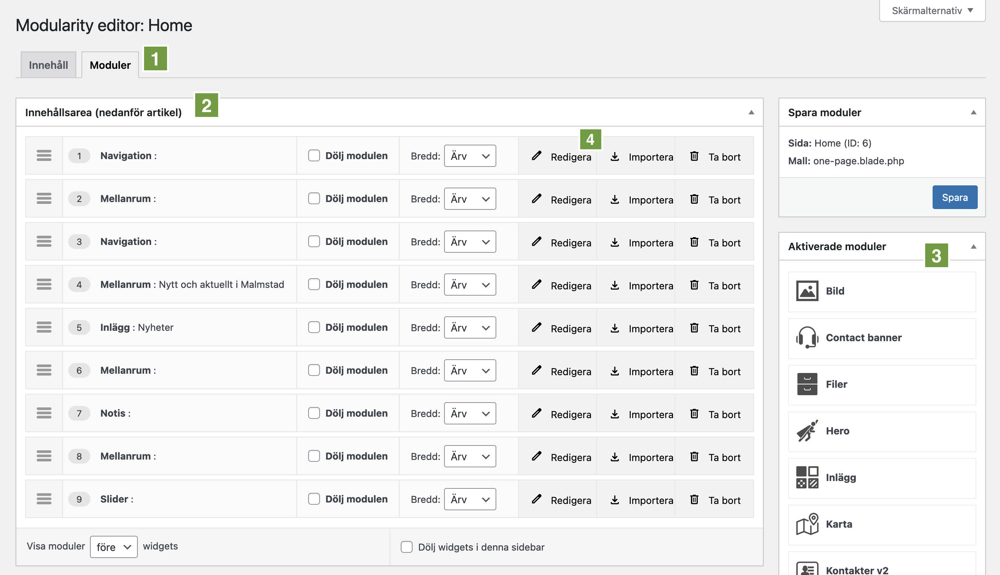
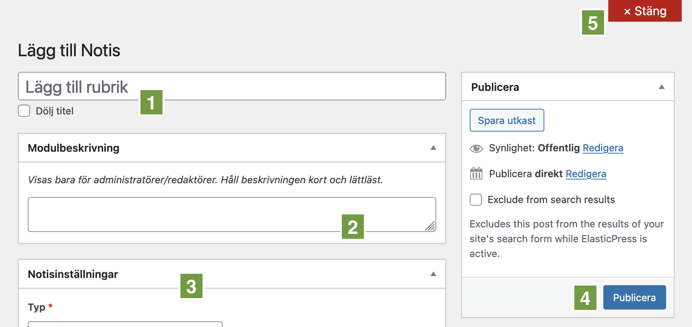
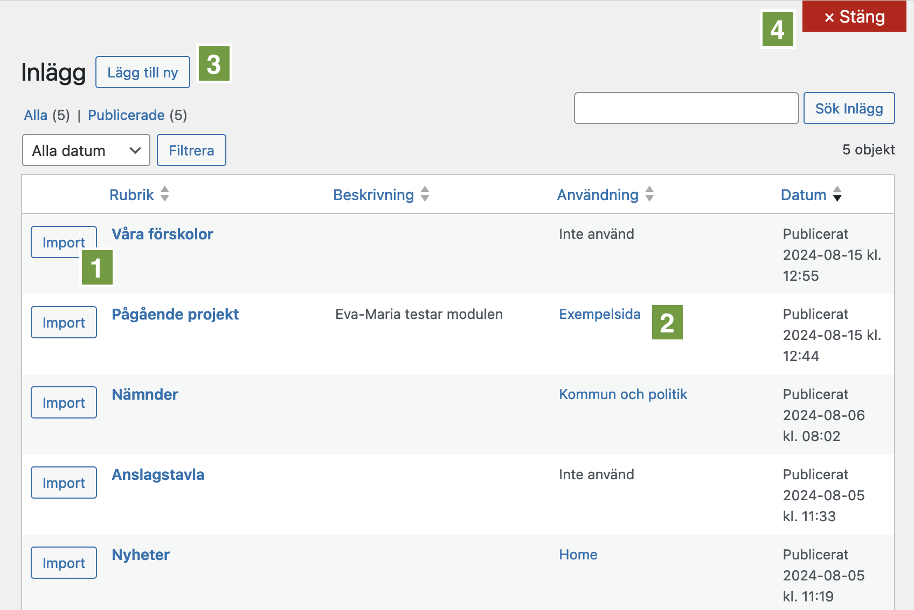

# Moduler

Förutom Wordpress vanliga texteditor kan du i Municipio skapa innehåll med hjälp
av moduler. Moduler är färdiga block som du kan lägga till i din sida för att
skapa olika typer av innehåll. Moduler kan vara allt från en enkel tabell till
en modul för att visa nyheter.

## Moduleditorn

När du redigerar en sida ser du längst upp två flikar – _Innehåll_ och
_Moduler_. Klicka på _Moduler_ för att komma till moduleditorn **(1)**.

Moduler kan läggas i olika ytor på sidan beroende på hur din webbplats är
uppbyggd och vilken typ av sida du redigerar. Den yta som används oftast heter
_Innehållsarea (nedanför artikel)_ **(2)**. Moduler som placerar där hamnar
efter sidans vanliga brödtext. Andra vanliga ytor är _Under sidhuvud (Heroyta)_
och _Ovanför sidfot (täcker hela fönstrets bredd)_

Till höger ser du en lista på alla tillgängliga modultyper. Dra en modul
härifrån och släpp på en yta för att skapa en ny modul eller importera en
befintlig av den typen **(3)**.

När du dragit en modul till en yta måste du välja om du vill skapa en ny från
grunden eller importera en befintlig modul genom att klicka på _Redigera_
**(4)** eller _Importera_
([läs mer om att importera moduler nedan](#importera-moduler)). Vi börjar med
att titta på hur redigeringen går till.

## Redigera modul

Om du har dragit in en ny modul eller vill redigera en av dem som redan ligger i
an av modulytorna klickar du på _Redigera_. Då öppnas en dialog där du kan fylla
i modulens innehåll och inställningar. Olika typer av moduler har olika
inställningar och fält att fylla i, men några är gemensamma

### Gemensamma fält för alla moduler

Alla moduler kan ha en titel och du kan välja om den ska visas upp för besökaren
eller bara vara synlig för redaktörer **(1)**. Du behöver inte ange någon titel
alls, men det blir lättare att hitta den om den har en titel.

Du kan också ange en beskrivning som bara visas för redaktörer **(2)**.

Därefter följer inställningar som är specifika för varje modultyp. **(3)**.

När du är klar klickar du på _Publicera_ för att spara modulen **(4)** eller
_Stäng_ längst upp till höger för att avbryta **(5)**.

:::info[Obs!]

När du kommer tillbaka till modulöversikten måste du komma ihåg att trycka på
_Spara_ i rutan till höger, annars kommer inte modulen dyka upp på sidan.

:::

### Olika modultyper

Det finns många olika modultyper att välja mellan men vilka som finns kan skilja
sig mellan olika webbplatser. Här är de vanligaste modultyperna. Klicka för mer
information:

- [Bild](./bildmodul.md) – Lägg in en bild med bildtext och länk.
- [Tabell](./tabellmodul.md) – Skapa en tabell med valfritt antal rader och
  kolumner.
- [Text](./textmodul.md) – Skapa en text med rubriker och stycken, med eller
  utan bakgrundsplatta.

## Placering av moduler

I modulöversikten kan du byta ordning på moduler men också ändra bredd på dem.
För att flytta en modul drar du den till en ny plats i listan.

För att ändra bredd klickar du på rullgardinen _Bredd_. På detta sätt kan du
även placera moduler bredvid varandra. Två moduler med 50% kommer till exempel
hamna bredvid varandra på större skärmar.

Du kan också tillfälligt dölja moduler genom att kryssa i _Dölj modulen_.

Klicka på _Ta bort_ och du vill ta bort modulen från den här sidan. Modulen
finns kvar och du kan importera den igen på den här eller andra sidor.

:::info[Obs!]

Kom ihåg att trycka på _Spara_ i rutan till höger när du är klar.

:::

## Importera moduler

Ibland vill man använda samma modul på flera sidor, eller förbereda en modul
innan du lägger till den på en sida. Då kan du importera en befintlig modul. Som
nämnts ovan kan du istället för att trycka på _Redigera_ klicka på _Importera_
på en rad i modulöversikten. Då visas en dialog där du kan välja bland
befintliga moduler av den typen.

I dialogrutan som visas ser du en lista på alla valbara moduler. När du hittar
den modul du vill använda klickar du på knappen _Import_ **(1)**. I denna vy kan
du också se på vilka andra sidor denna modul används **(2)**.

Om du inte hittar en modul som passar kan du välja att skapa en ny genom att
klicka på _Lägg till ny_ **(3)** eller stänga dialogen genom att klicka på
_Stäng_ **(4)**.

### Hantera alla moduler

Om du vill se alla moduler som finns på webbplatsen, oavsett om de används eller
inte kan du gå till _Modularity_ i adminpanelens vänstermeny. Där under finns en
vy för varje modultyp, t.ex. _Redigera Tabeller_. Vyn som visas när du klickar
på en av dessa liknar den som visas vid importering av moduler. Du kan se på
vilka sidor modulen används och även skapa nya moduler utan att behöva gå till
en sida. Dessa moduler kan sedan importeras på sidor som vanligt.
