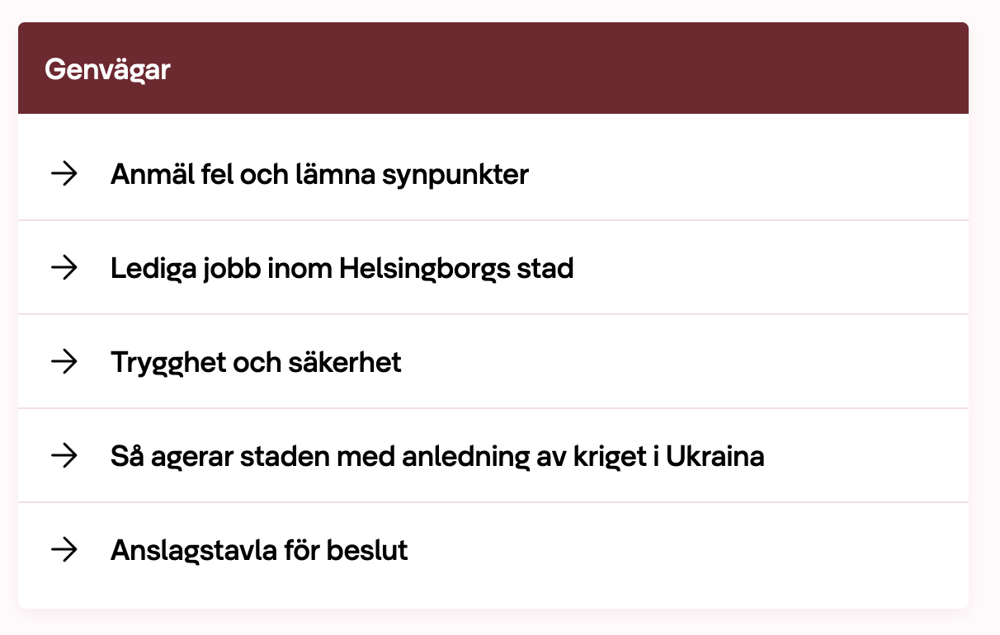
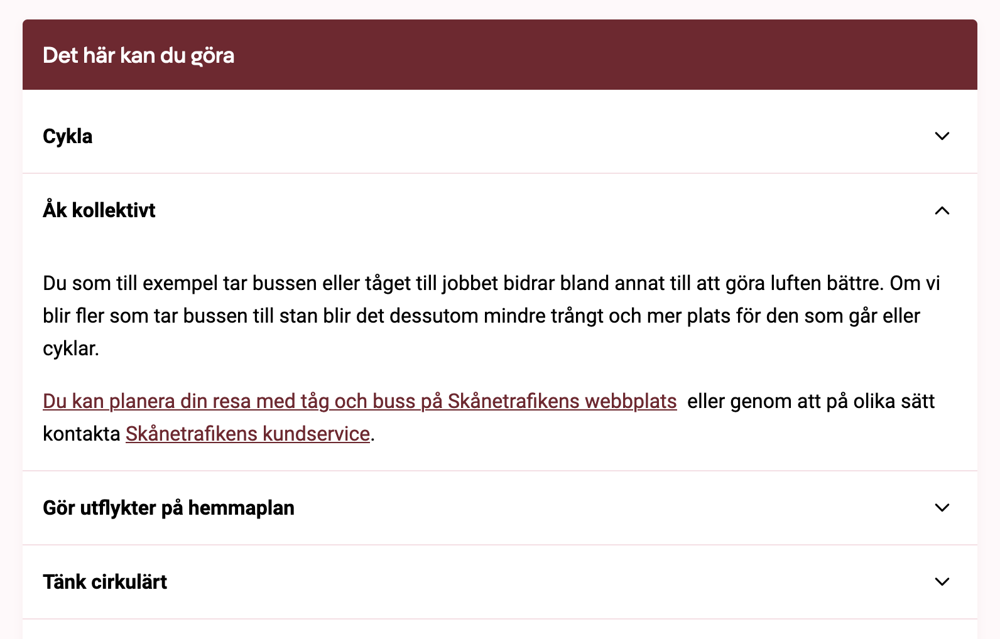

# Inläggsmodul

Modulen _Inlägg_ har många användningsområden. Den kan användas för att visa upp
de senaste nyheterna, skapa listor med genvägar, puffar till andra sidor,
utfällbara frågor och svar och mycket mer. Detta är den mest komplexa modulen i
Municipio.

## Exempel

Exempel på vad du kan skapa med inläggsmodulen:

## Visningslägen

Inläggsmodulen har flera olika visningslägen:

- **Lista** – Visar inläggen som en lista av länkar.
- **Expanderbar lista** – Visar inläggen som en lista av utfällbara sektioner.
- **Index** – Visar inläggen som kort med bild, rubrik, text och datum.
- **Segment** – Visar inläggen som bild och textplatta.
- **Collection** – Visar inläggen som en lista med bild och text.
- **Kort och lista** – Visar några av inläggen som kort och resten som en lista.
