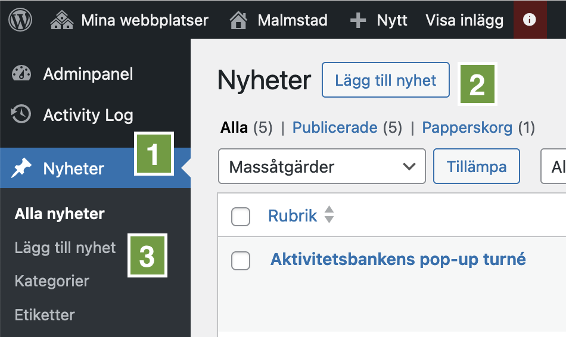
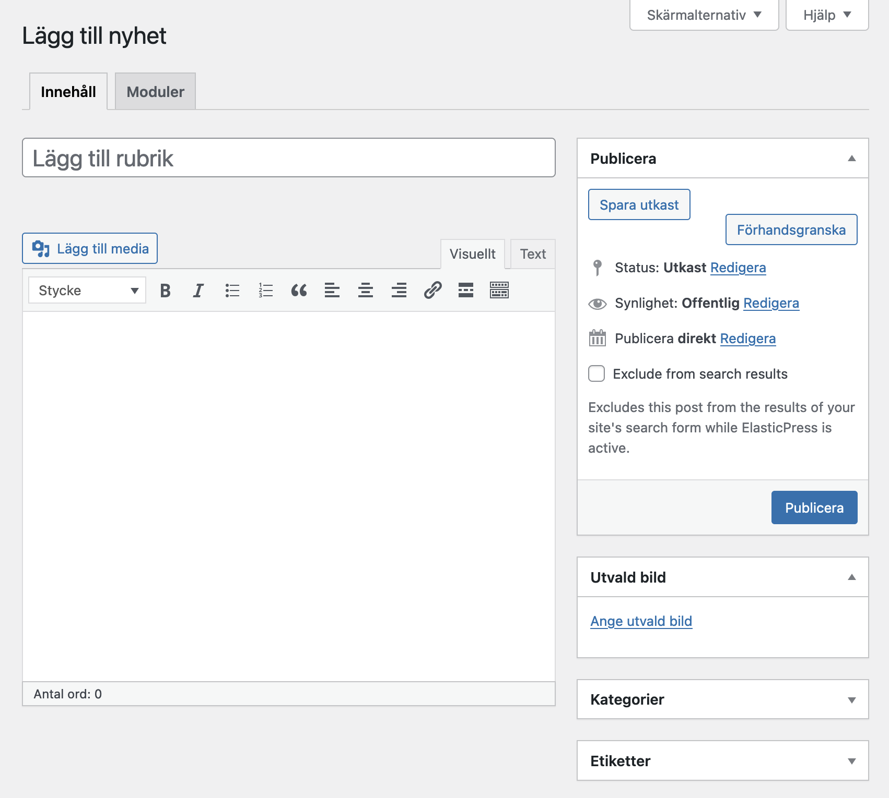

För att publicera en nyhet i Municipio går du till _Nyheter_ i adminpanelens
vänstermeny **(1)**. Du kommer då till vyn _Alla nyheter_ där du ser en översikt
av alla nyheter. Härifrån kan du klicka på _Lägg till ny nyhet_ längst upp på
sidan för att skapa en ny nyhet **(2)**.

Du kan också skapa en nyhet direkt från adminpanelens vänstermeny via menyn som
kommer upp när du håller muspekaren över _Nyheter_ **(3)**.

Därefter kommer du till redigeringsvyn för den nya nyheten. Ange en titel och
skriv sedan din nyhetstext i texteditorn. Du kan formatera texten med hjälp av
verktygsfältet ovanför texteditorn, ungefär som i Word. Det går också att lägga
till bilder och länkar.
[Läs mer om hur du lägger till bilder här](./bilder-mediabiblioteket.md).

## _Utvald bild_

Kom ihåg att ange en s.k. utvald bild så att nyheten får en bild i listningar på
t.ex. startsidan, nyhetsarkivet och sökresultat. Du gör det genom att klicka på
_Ange utvald bild_ i rutan _Utvald bild_ till höger om texteditorn. Du kan välja
bilder från mediabiblioteket eller ladda upp en ny bild.
[Läs mer om hur du lägger till bilder här](./bilder-mediabiblioteket.md).

## _Kategorier_ och _Etiketter_

Om din webbplats har stöd för kategorier och etiketter kan du även ange dessa i
rutorna _Kategorier_ och _Etiketter_ till höger om texteditorn. Dessa kan
användas för att skapa filtrerade listor med inläggsmoduler.

## Förhandsgranska, spara som utkast och publicera

I rutan _Publicera_ längst upp till höger kan du välja att publicera nyheten
direkt eller spara den som utkast. Du kan också förhandsgranska den utan att
spara för att se hur den kommer att se ut på webbplatsen.
