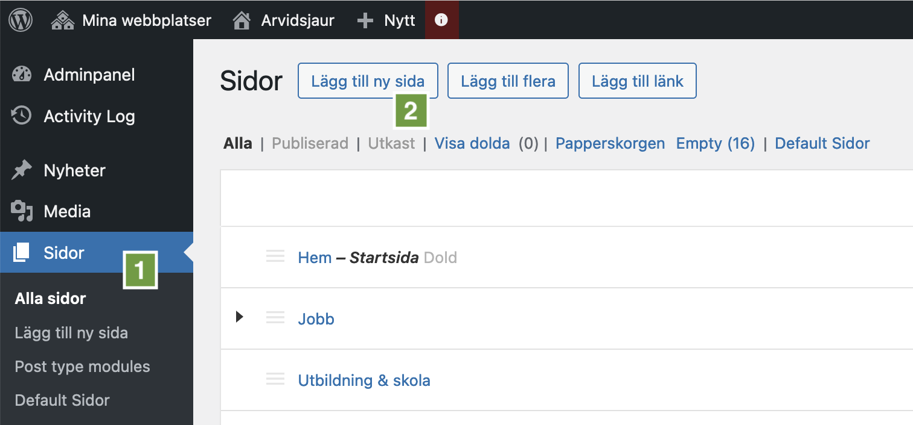
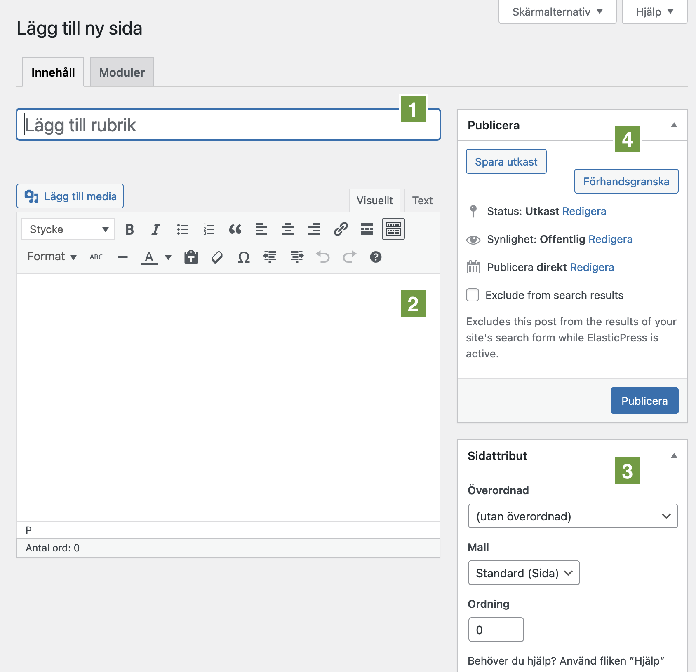
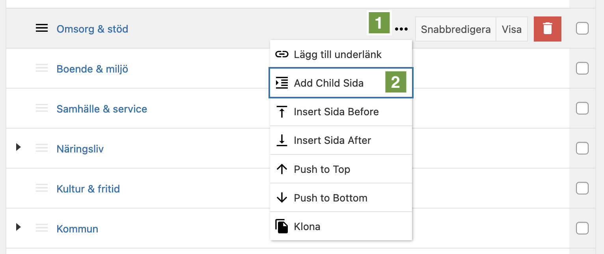
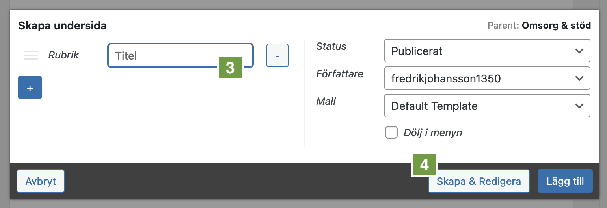

# Skapa en ny sida

Det finns flera sätt att skapa en ny sida i Municipio. Här går vi igenom de vanligaste sätten.

Börja med att gå till _Sidor_ i adminpanelens vänstermeny **(1)**. Du kommer då till vyn _Alla sidor_ där du ser en översikt av sidträdet.

Härifrån kan du klicka på _Lägg till ny sida_ **(2)** för att skapa en ny sida.

Därefter kommer du till redigeringsvyn för den nya sidan. Här kan du fylla i sidans titel **(1)** och innehåll **(2)**. Till höger finns en ruta med titeln _Sidattribut_. Använd fälten _Överordnad_ och _Ordning_ **(3)** för att välja plats i sidträdet.

I rutan _Publicera_ **(4)** kan du välja att publicera sidan direkt eller spara den som utkast. Du kan också förhandsgranska den utan att spara för att se hur den kommer att se ut på webbplatsen.

## Skapa sida direkt i sidträdet

Ett annat sätt att skapa en ny sida som direkt hamnar på rätt ställe i sidträdet kan du göra såhär:

1. Gå till _Sidor_ i adminpanelens vänstermeny.
2. Håll muspekaren över den sida som ska vara överordnad till den nya sidan.
3. Klicka på de tre punkterna som dyker upp längst till höger på raden **(1)**.
4. Välj _Add Child Sida_ **(2)**.
5. I rutan som kommer upp anger du en titel **(3)** och klickar sedan på _Skapa & Redigera_ **(4)**.

Därefter kommer du till redigeringsvyn för den nya sidan, men fälten _Överordnad_ och _Ordning_ är då redan ifyllda.

